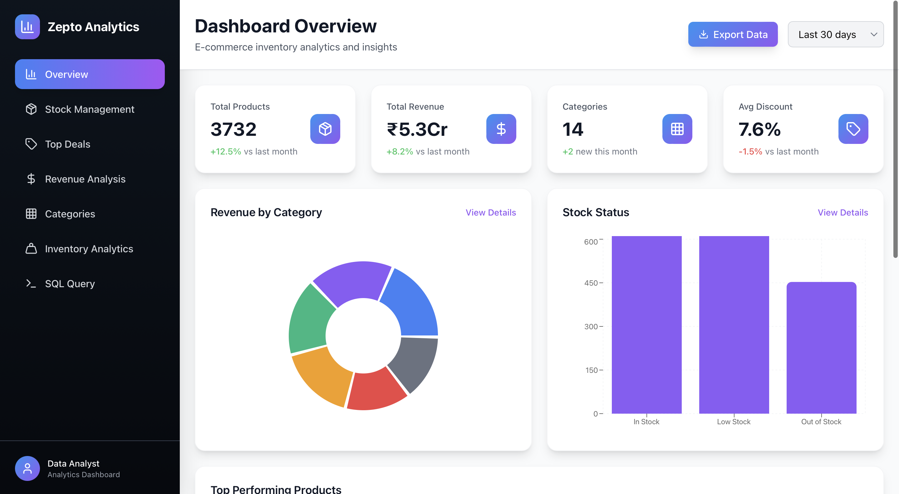
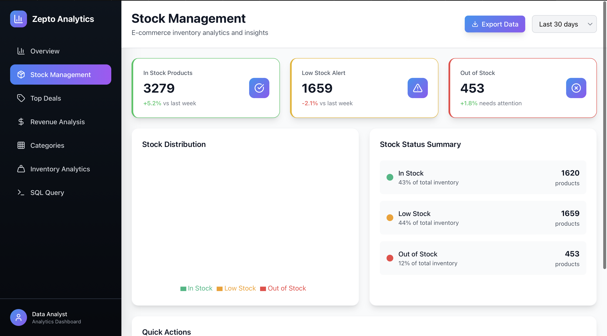
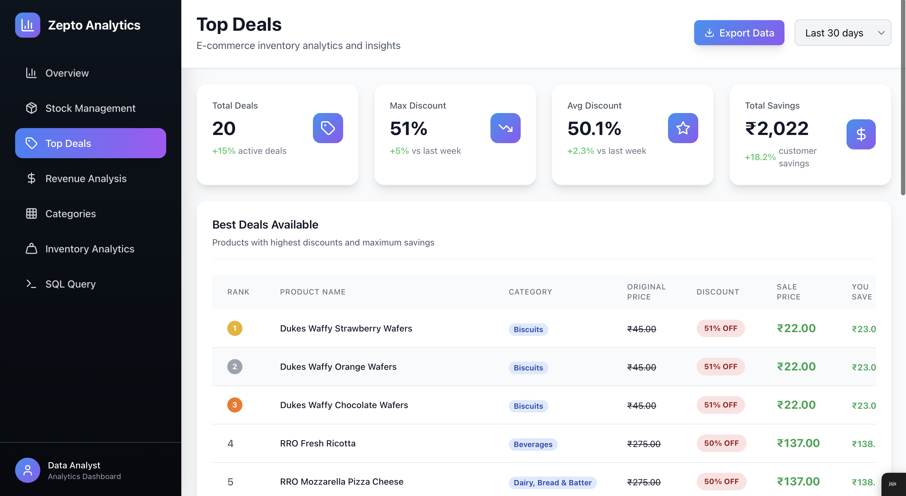
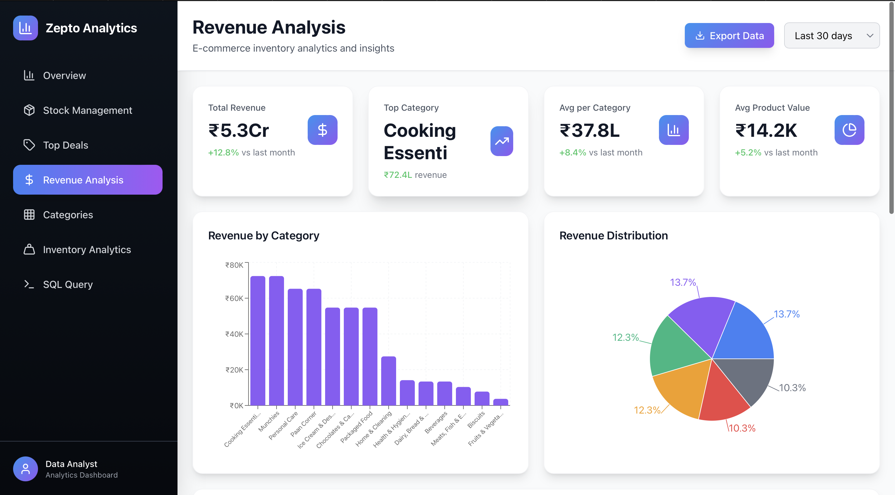
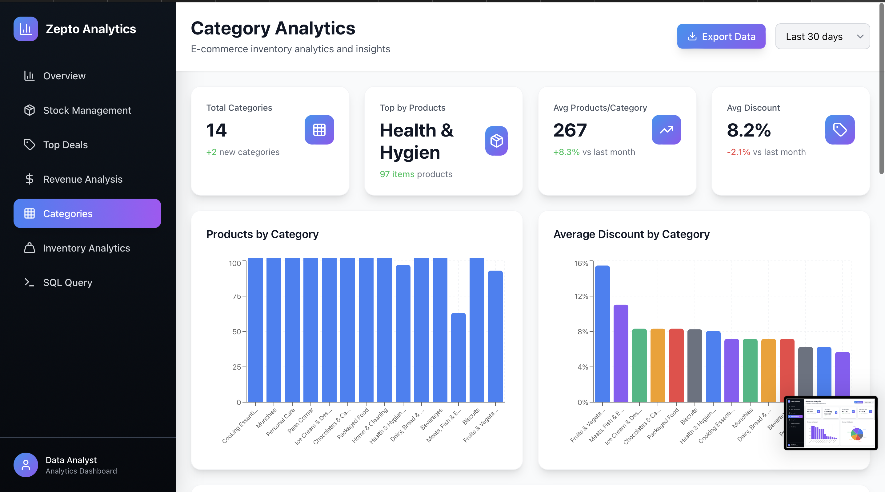
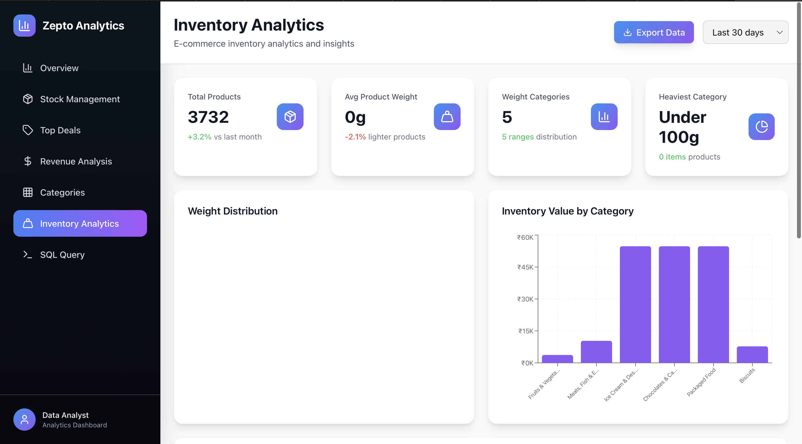
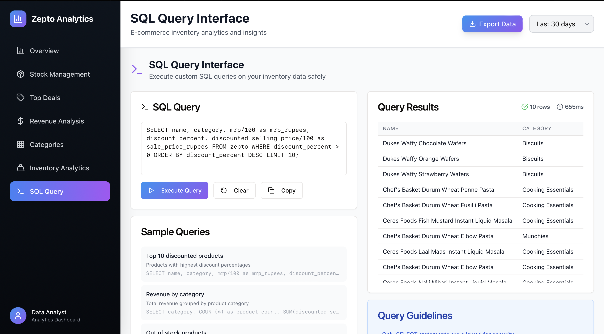

# Zepto Analysis Dashboard

A complete ETL pipeline with backend and React dashboard for e-commerce inventory analytics using PostgreSQL database.

## Features

### Backend (FastAPI)
- **REST API endpoints** for comprehensive analytics
- **PostgreSQL integration** with existing zepto database
- **ETL pipeline** for CSV data processing and loading
- **SQL query interface** with safety validation
- **Real-time analytics** for business insights

### Frontend (React)
- **Professional dashboard** 
- **7 analytical views**: Overview, Stock, Deals, Revenue, Categories, Inventory, SQL Query
- **Interactive charts** using Recharts library
- **Real-time data visualizations**

### Analytics Features
- Overview metrics (total products, revenue, categories, avg discount)
- Stock status analysis (in-stock vs out-of-stock breakdown)
- Top deals with highest discounts and savings
- Revenue analysis per category with market share
- Category performance with discount rankings
- Inventory weight distribution analysis
- Custom SQL query execution with sample queries

## Technology Stack

### Backendrk
- **SQLAlchemy** - Database ORM
- **PostgreSQL** - Database (existing zepto_project.zepto table)
- **pandas** - Data processing for ETL
- **psycopg2** - PostgreSQL adapter
- **python-dotenv** - Environment configuration

### Frontend
- **React 18** with TypeScript
- **Tailwind CSS** - Styling framework
- **shadcn/ui** - UI component library
- **Recharts** - Data visualization
- **TanStack Query** - Data fetching and caching
- **Wouter** - Client-side routing

## Prerequisites

- Node.js 18+ and npm
- Python 3.9+
- PostgreSQL database with zepto table
- Environment variables configured

##  Screenshots

###  Homepage

###  Dashboard

###  Search Feature

###  Product Details

###  Analytics

###  Report View

###  Export Option

## Demo Videos

###  Query Tool Demo
[▶️ Click to watch query tool.mov](./ZeptoAnalysis/query%20tool.mov)

### ⚙ Working Demo of the App
[▶️ Click to watch working.mov](./ZeptoAnalysis/working.mov)

